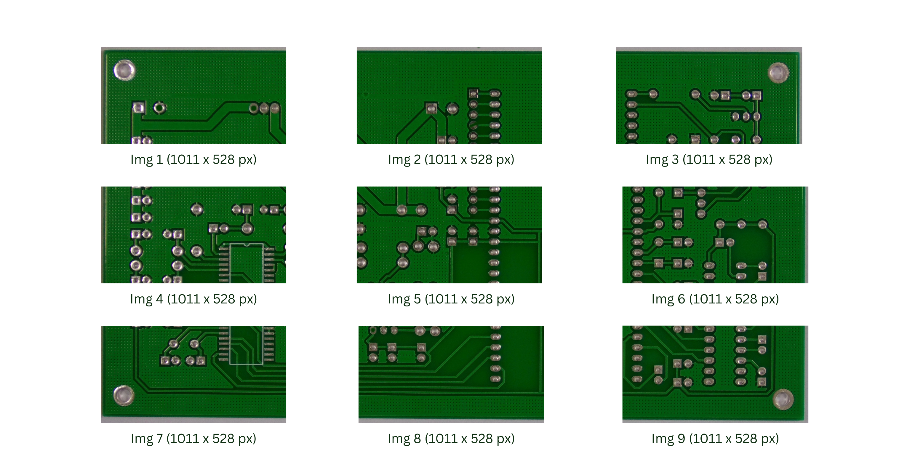

# 🧩 Image Processed for Training

This folder shows how a large original PCB image was processed into smaller, same-sized patches for model training.

---

## 📸 Image Overview

**Original Image (3034 × 1586)**  

  ⬇️⬇️⬇️  

**Processed Image (Each patch: 1011 × 528)**  

---

## 🧠 Explanation

- The **original image** was manually divided into smaller, equal-sized patches for consistent YOLO training input.  
- Each **processed image patch** is **1011 × 528 pixels** (W × H).  
- Uniform patch sizes help YOLO learn **localized PCB defects** more efficiently.  
- This example visually explains the preprocessing workflow used before model training.

---

## 🗂️ Folder Contents

